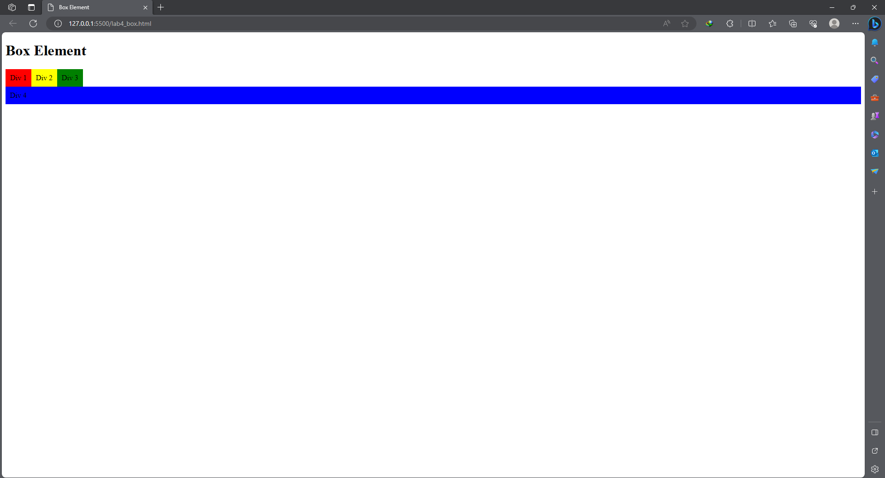
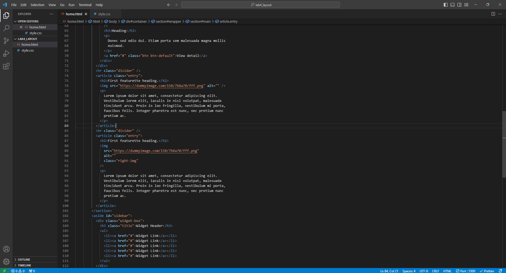

# Lab3Web

## Persiapan membuat dokumen HTML dengan nama file lab4_box.html seperti berikut.

## Membuat Box Element

## CSS Float Property

## Mengatur Clearfix Element

## Lakukan eksperimen terhadap penggunaan property clear dengan nilai lainnya (left, both, right) dan amati perubahannya

## Membuat Layout Sederhana

Buat folder baru dengan nama lab4_layout, kemudian buatlah file baru didalamnya dengan nama home.html, dan file css dengan nama style.css

## Tambahkan kode CSS untuk membuat layoutnya

## Membuat Navigasi

## Membuat Hero Panel

## Mengatur Layout Main dan Sidebar

## Mengatur Footer

## Menambahkan Elemen lainnya pada Main Content

## Menambahkan Content Artikel

## Pertanyaan dan Tugas

### 1. Tambahkan Layout untuk menu About
   # => buat single layout yang berisi deskripsi, portfolio, dll

### 2. Tambahkan layout untuk menu Contact
   # => yang berisi form isian: nama, email, message, dll

